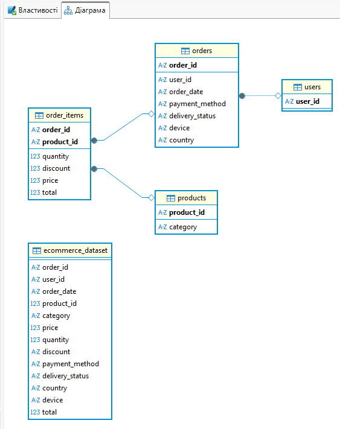

# goit-course-ecommerce-analytics
Цей репозиторій містить навчальний SQL-проєкт, виконаний у межах курсу Data Analytics від GoIT. 
Дані взято з навчального e-commerce датасету курсу. 

Мета роботи – попрактикувати нормалізацію даних, побудову схеми бази та exploratory analysis за допомогою SQL і DBeaver на прикладі умовного інтернет-магазину.
Датасет містить інформацію про замовлення, користувачів і товари: order_id, user_id, order_date, product_id, category, price, quantity, discount, payment_method, delivery_status, country, device, total.

users: user_id – логічний primary key

orders: order_id – логічний primary key, user_id – foreign key на users.user_id

order_items: order_id, product_id – деталі замовлення (foreign key на orders.order_id та products.product_id)

products: product_id – логічний primary key

Під час попереднього аналізу я перевірила узгодженість цін: total = price * quantity – discount, тому price інтерпретую як ціну за одиницю товару.
В цьому навчальному наборі кожен користувач має одне замовлення, тому retention і середній час між першою і другою покупкою оцінити неможливо.
Всі замовлення мають ненульову знижку, тому я аналізую різні рівні знижок між собою (low / medium / high), а не порівнюю зі знижкою та без.
Невеликий обсяг даних (600 рядків), тому висновки лише для ілюстрації аналізу на основі синтетичних даних.

Схема бази даних

## E-commerce performance dashboard

