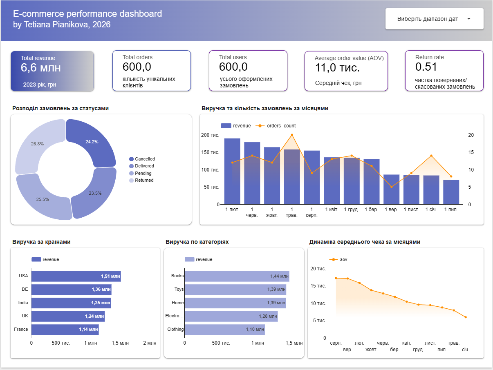

# goit-course-ecommerce-analytics

SQL mini-project based on an educational e-commerce dataset from the GoIT Data Analytics course.

The goal of this project is to practice:
- normalising a “flat” CSV table into a simple relational schema (users, orders, order_items, products)
- writing SQL queries for typical e-commerce questions
- building a small performance dashboard in Looker Studio

Files in this folder:
- `ecommerce_dataset.csv` – original flat dataset with orders, users and products
- `01_schema.sql` – SQL script that creates the schema (tables, primary/foreign keys)
- `02_analysis.sql` – analysis queries (categories, discounts, statuses, countries, monthly dynamics)
- `03_results.md` – screenshots of query results with short comments
- `er_ecommerce.png` – ER diagram of the database
- `dashboard/` – screenshots and PDF of the e-commerce performance dashboard
- `README.md` – project description and limitations

Key questions answered:
- Which product categories are most popular by number of orders and by revenue?
- What is the average order value (AOV) and average revenue per user (ARPU)?
- How do different discount ranges (low / medium / high) affect orders and revenue?
- Which countries bring the most users and the most revenue? How does AOV differ by country?
- What is the share of orders in different statuses (Delivered / Cancelled / Returned / Pending)?
- How do revenue, number of orders and AOV change by month (for Delivered orders)?

Tools:
- SQL (SQLite via DBeaver)
- Google Looker Studio (dashboard)

Note: this is a small synthetic dataset (~600 rows).  
Each user has only one order, so it’s not possible to analyse retention or time between first and second purchases.  
All orders have a non-zero discount, so I compare discount levels (low / medium / high) between each other instead of “with vs without discount”.

---

## Опис українською

Цей репозиторій містить навчальний SQL-проєкт, виконаний у межах курсу Data Analytics від GoIT.  
Дані взято з навчального e-commerce датасету курсу.

Мета роботи – попрактикувати нормалізацію даних, побудову схеми бази та exploratory analysis за допомогою SQL і DBeaver на прикладі умовного інтернет-магазину.  
Датасет містить інформацію про замовлення, користувачів і товари: `order_id`, `user_id`, `order_date`, `product_id`, `category`, `price`, `quantity`, `discount`, `payment_method`, `delivery_status`, `country`, `device`, `total`.

**Схема даних:**

- `users`: `user_id` – логічний primary key  
- `orders`: `order_id` – логічний primary key, `user_id` – foreign key на `users.user_id`  
- `order_items`: `order_id`, `product_id` – деталі замовлення (foreign key на `orders.order_id` та `products.product_id`)  
- `products`: `product_id` – логічний primary key  

Під час попереднього аналізу я перевірила узгодженість цін:  
`total = price * quantity – discount`, тому `price` інтерпретую як ціну за одиницю товару.

У цьому навчальному наборі кожен користувач має одне замовлення, тому retention і середній час між першою і другою покупкою оцінити неможливо.  
Усі замовлення мають ненульову знижку, тому я аналізую різні рівні знижок між собою (low / medium / high), а не порівнюю зі знижкою та без.  
Невеликий обсяг даних (близько 600 рядків), тому висновки слугують лише для ілюстрації аналізу на основі синтетичних даних.

## E-commerce performance dashboard

